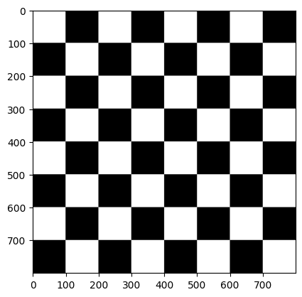
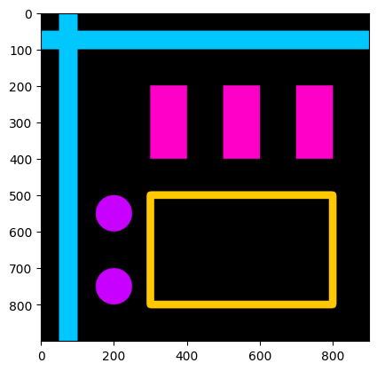
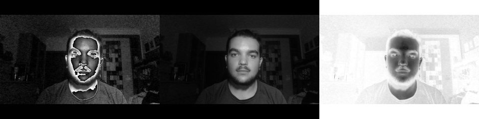
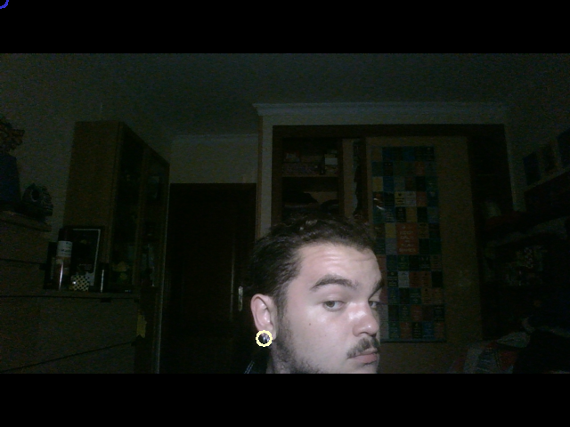
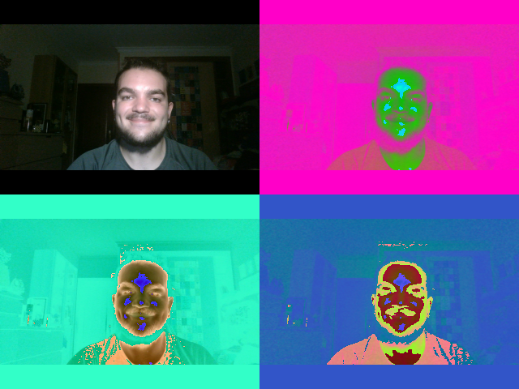

# P1 - Primeros pasos con OpenCV
  
## Desarrollo

### Tarea 1 - Tablero de ajedrez

**El código genera una imagen con un tablero de ajedrez.**

- El primer paso es crear la matriz imagen_ajedrez, con un tamaño de 800x800. Se inicializa con todo a 0, para que desde un principio, la imagen en escala de grises se vea completamente negra.

- Después, en un doble bucle comprobamos que las "casillas" que estamos comprobando, es decir, las que vamos a dibujar, son pares o no, para pintar alternativamente de blanco o negro.

- Si la casilla debe pintarse de blanco, se calcula el espacio con los índices actuales y se dibuja. Al final, la imagen se muestra en escala de grises y se comprueba que se ve un tablero de ajedrez



Figura 1: Tablero de ajedrez generado

### Tarea 2 y 3 - Imagen estilo Mondrian + Funciones de OpenCV

**El programa, al igual que el anterior, crea una matriz inicializada a 0 que representa una imagen , ahora de 900x900 píxeles con tres canales de color (RGB). Además, fue el ejercicio que se modificó con las funciones de dibujo de OpenCV**

Luego, se modifican partes de la imagen para que tomen colores y formas distintas, líneas, rectángulos, círculos, todos con la posibilidad de rellenarse.
```py
# Líneas celestes cruzadas - 50px
cv2.line(imagen_mondrian,(75, 0), (75, 900), (0, 200, 255), 50)

# Rectángulo amarillo - 20px
cv2.rectangle(imagen_mondrian, (300, 800), (800, 500), (255, 200, 0), 20)

# Rectángulos color rellenos
cv2.rectangle(imagen_mondrian, (300, 400), (400, 200), (255, 0, 200), -1)

# Círculo violeta relleno - 50px = r
cv2.circle(imagen_mondrian, (200, 750), 50, (200, 0, 255), -1)
```

- En este caso, han sido líneas azules, varios rectángulos en distintas orientaciones y algunos círculos.

- Para mostrar la imagen en color, se utiliza `plt.imshow(color_img)` sin especificar el mapa de color.

- `plt.show()` muestra con Matplotlib la imagen con colores y formas.



Figura 2: Imagen de estilo Mondrian

### Tarea 4 - Modificación de valores de un plano de imagen

En primer lugar, el código se encarga de separar los 3 planos de color de la imagen en variables `r`, `g`, y `b`.

Tras esto, se modifican estos valores de los planos de la imagen y se guardan de nuevo en las variables. En este caso, las modificaciones: 

```py
      ...
        frame[:,:,0] = 255 - r
        frame[:,:,1] = g / 2 + r / 2
        frame[:,:,2] = r - b
      ...
```

Tras esto, cada plano se utiliza como un plano único en una escala de grises, generando resultados distintos cada uno. El primero oscurece las caras, el segundo no parece variar mucho de una escala de grises normal y el tercero vuelve negativa la imagen.

  

### Tarea 5 - Destacando la región 8x8 más clara y más oscura

A través de la captura de vídeo de la webcam y mediante un bucle se puede obtener lo que buscamos.

- Con la ayuda de algunas funciones de NumPy, se puede obtener la región de valores más altos y la región de valores más bajos.

- `np.argmax y np.argmin` se encargan de hallar el máximo, el mínimo a lo largo de un eje de un array y la posición de ambos. Devuelve un array con los índices que contienen las coordenadas 
- `np.unravel_index` utiliza dos argumentos, un array de índices, y una tupla con las dimensiones del array, lo que permite ubicar los píxeles en la matriz de la imagen. el resultado es una tupla de 3 elementos con todas las coordenadas, por lo que se debe ignorar la coordenada Z.

- Al final, se muestra una ventana con la cámara mostrando la región más clara y oscura.



### Tarea 6 - Propuesta de popart

- Primero se reduce hasta la mitad la resolución para ocupar menos espacio en pantalla, y posteriormente, crearemos un espacio del doble de tamaño que esta cámara reducida en ambas direcciones. Cada parte tiene un filtro distinto. De arriba izquierda a abajo derecha:

- `tl` se mantiene con la imagen sin modificar de la cámara, para poder visualizar con normalidad.
  
- `tr` prácticamente invierte el azul, e invierte el rojo, dejando intacto el verde. De esta forma se produce un fondo rosa y un tono verde en la piel.
 
- `bl` deja casi invertido el azul, invierte el verde y elimina un poco del rojo. Con esto, se obtiene un fondo turquesa y un color de piel naranja oscuro.
  
- Finalmente `br` cambia todos los colores:

  ```py
    ...
        br[:,:,0] = 200 - g
        br[:,:,1] = 85 + r
        br[:,:,2] = 50 - b
    ...
  ```
En este caso, el valor del plano azul corresponde a casi la inversión del verde. El plano verde obtiene el rojo potenciado y el plano rojo obtiene una ligera disminución del azul. Así, como resultado se ve un fondo azul y la piel en tonos amarillos y rojos.



Figura 6: Pop art

## Fuentes de información

Las fuentes utilizadas como ayuda fueron para el desarrollo de algunas tareas:
- [numpy](https://numpy.org/doc/stable/index.html)

Realizado por:
- Antonio Medina Santana
